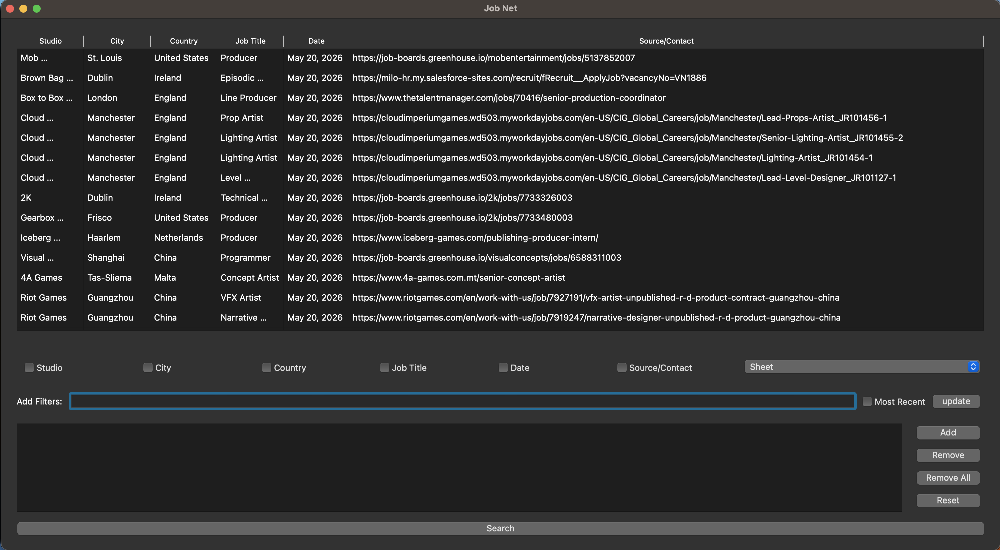

# Jobnet

A Python tool for fetching, filtering, and managing vfx, animation and games job postings with both a graphical and command-line interface.

This tool relies heavily on the amazing work done by Chris Mayne on [**Animation/VFX/Game Industry Job Posting**](https://docs.google.com/spreadsheets/d/1eR2oAXOuflr8CZeGoz3JTrsgNj3KuefbdXJOmNtjEVM/edit?gid=0#gid=0)



## Requirements

- Python 3.8+
- Google API credentials (Google Sheets API enabled)

## Installation

1. Clone the repository:
```bash
git clone https://github.com/marco-lopiano/Jobnet.git
cd jobnet/code
```

2. Create a virtual environment (optional):
```bash
python -m venv venv
source venv/bin/activate  # Linux/macOS
# or
venv\Scripts\activate     # Windows
```
I personally used [miniconda](https://www.anaconda.com/download) to handle virtual environments

3. Install dependencies:
```bash
pip install -r requirements.txt
```

## Google API Setup

1. Go to [Google Cloud Console](https://console.cloud.google.com/)
2. Create a new project or select an existing one
3. Enable the Google Sheets API
4. Create credentials (Service Account):
   - Go to APIs & Services → Credentials
   - Click Create Credentials → Service Account
   - Grant appropriate roles (Viewer access to your job sheet)
   - Create and download a JSON key file
5. Share your Google Sheet with the service account email address

6. Create a `.env` file in the project root:
```
GOOGLECLIENTKEY=/path/to/your/service-account-key.json
```
In case of any issues, the official google resource about credentials is pretty extensive:
 https://developers.google.com/workspace/guides/create-credentials

## Usage

### Graphical Interface

Launch the GUI application:

```bash
python src/main.py -ui
```

### Command Line Interface

Run with filters and column selection:

```bash
python src/main.py -f "Python Developer" "Remote" -c "Job Title" "City"
```

#### Arguments

| Argument | Short | Description |
|----------|-------|-------------|
| `--filters` | `-f` | Keywords to filter data (space-separated) |
| `--columns` | `-c` | Column names to filter against (space-separated) |
| `--ui` | `-ui` | Launch graphical interface |
| `--mostRecent` | `-mr` | Sort by most recent entries first |

#### CLI Interaction

When running in CLI mode:
1. View matching job postings
2. Enter space-separated indexes to open specific listings
3. View source/contact information for selected entries

### Available Columns

- Studio
- City
- Country
- Job Title
- Date
- Source/Contact

## Project Structure

```
Jobnet/code/
├── src/
│   ├── main.py                     # Entry point and argument parsing
│   ├── ui.py                       # PyQt5 GUI implementation
│   ├── cli.py                      # Command-line interface
│   ├── database.py                 # Google Sheets data fetching
│   ├── filtering.py                # Filtering logic
│   └── utils/
│       ├── pandasCustomModel.py    # Table model for Qt
│       ├── customMapView.py        # Map visualization
│       ├── checkableComboBox.py    # Custom combo box widget
│       └── misc.py                 # Utility functions
├── icon/                           # Application icons
├── requirements.txt                # Python dependencies
└── README.md                       # This file
```

## Dependencies

Key packages include:
- **PyQt5** - GUI framework
- **pandas** - Data manipulation
- **pygsheets** - Google Sheets API client
- **folium** - Map visualization
- **fuzzywuzzy** - Fuzzy string matching

See `requirements.txt` for complete list.

## License

MIT License
